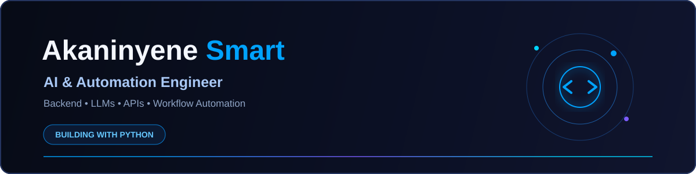

<div align="center">



<br>

<a href="https://www.linkedin.com/in/akan-smart/">

</a>
&nbsp;
<a href="https://akaninyenesmart.netlify.app">

</a>
&nbsp;
<a href="https://github.com/smartakaninyene5-gif">

</a>

</div>

<br>

> **Learning by building. Building to understand.**

---

## `01` — About Me

I'm **Akaninyene Smart**, a Computer Engineering student building toward AI engineering.

I work mainly with **Python**, backend APIs, LLM applications and workflow automation. Most of what I learn gets turned into a project, experiment or practical build.

```text
AI Engineering     → LLM Applications • RAG • AI Agents
Backend             → FastAPI • Django • REST APIs
Automation          → n8n • APIs • AI Workflows
Engineering         → Python • Git • GitHub • Linux/CLI